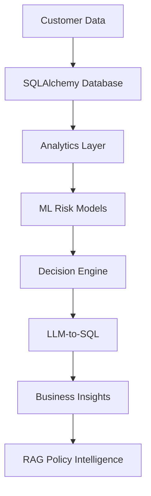

# AI FinTech Decision Intelligence System

An end-to-end AI-powered FinTech platform that combines:

- Credit Risk Analytics
- Portfolio Analytics
- Probability of Default (PD) Modeling
- Decision Intelligence
- LLM-to-SQL
- RAG-based Policy Intelligence

---

## Architecture

---

## Current Features

✅ Lending Database Design

✅ SQLAlchemy ORM

✅ Synthetic Lending Data Generator

✅ Portfolio Analytics

🔄 Risk Analytics

⏳ Probability of Default Model

⏳ Decision Engine

⏳ LLM-to-SQL

⏳ RAG Integration

---

## Technology Stack

- Python
- SQLAlchemy
- SQLite
- Pandas
- Scikit-learn
- FastAPI
- LangChain
- RAG

---

## Project Status

Active Development
